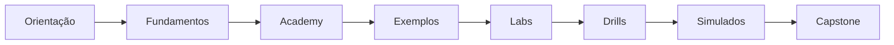

# 21 - Guia De Navegação Do Site

Este repositório também funciona como um site de estudo em formato de academia.
A navegação foi pensada para reduzir atrito: você pode começar pela trilha
guiada, abrir uma aula, assistir vídeos PT-BR, consultar fontes, marcar progresso,
abrir exemplos, fazer labs e resolver simulados sem precisar caçar arquivos no
GitHub.

Há duas entradas principais:

1. `index.html`: sala de aula, com módulos, aulas, filtros, progresso local,
   embeds de vídeo e links para materiais.
2. `docsify.html`: biblioteca renderizada, com todo o conteúdo Markdown,
   sidebar, busca e paginação.

A grade atual tem 94 aulas navegáveis. A intenção é que a home funcione como
uma escola: o aluno escolhe módulo, abre aula, vê explicação em camadas, acessa
fonte, pratica e marca progresso.

## Link Do Site

Quando o GitHub Pages estiver habilitado no repositório, o site ficará em:

```text
https://guilhermejacyzin.github.io/claude-certified-architect/
```

Se o Pages ainda não estiver ativo, abra a aba **Settings > Pages** no GitHub e
use **GitHub Actions** como fonte de publicação. O workflow `Deploy GitHub Pages`
publica o site automaticamente a cada push na branch `main`.

## Por Onde Começar

Na home da academia, use a aula **Como usar a academia**. Para estudar direto
pela biblioteca, use esta ordem:

1. `course/00-como-usar-o-curso.md`
2. `docs/00-mapa-exame.md`
3. `practice/simulado-bilingue-30-questoes.md`
4. `course/01-fundamentos.md`
5. `academy/README.md`
6. `examples/01-agentic-orchestration-10-exemplos.md`
7. `labs/lab-01-agentic-loop.md`
8. `drills/01-drills-academy.md`
9. `practice/simulado-academy-mcp-claude-code-40-questoes.md`
10. `course/05-avaliacoes-rubricas-capstone.md`

## Como Usar A Busca

A busca da home filtra aulas por título, objetivo, explicação, prática e nível.
A busca da biblioteca (`docsify.html`) indexa os arquivos Markdown. Pesquise por
termos como:

- `tool_use`
- `MCP resource`
- `hook`
- `structured output`
- `confidence`
- `prompt caching`
- `Claude Code`
- `handoff`
- `eval`
- `RAG`

Quando o resultado abrir na academia, a aula aparece no painel central. Quando
abrir na biblioteca, use o menu lateral para continuar no mesmo módulo.

## Como Estudar Por Perfil

| Perfil | Comece por | Depois faça |
|---|---|---|
| Precisa entender a certificação | `docs/00-mapa-exame.md` | `docs/03-guia-por-dominio.md` |
| Quer aprender do zero | `course/00-como-usar-o-curso.md` | `course/01-fundamentos.md` |
| Quer praticar arquitetura | `examples/01-agentic-orchestration-10-exemplos.md` | `docs/16-cenarios-integrados.md` |
| Quer dominar MCP | `academy/03-model-context-protocol.md` | `examples/02-mcp-tools-10-exemplos.md` |
| Quer dominar Claude Code | `academy/04-claude-code-em-acao.md` | `examples/03-claude-code-10-exemplos.md` |
| Quer treinar prova | `practice/simulado-bilingue-30-questoes.md` | `practice/questoes-comentadas-avancadas.md` |
| Quer controlar custo | `docs/20-estimativa-custos-token.md` | Planejar exemplos por classe |

## Roteiro Visual



## Convenções De Navegação

- **Academia**: primeira tela do site, pensada como sala de aula.
- **Biblioteca**: versão renderizada dos Markdown em `docsify.html`.
- **Curso principal**: sequência formal de estudo.
- **Academy expandida**: material estruturado a partir dos tópicos visíveis do
  learning path.
- **Apostila profunda**: referência por domínio, playbooks e custos.
- **Exemplos**: execução passo a passo por capacidade.
- **Labs**: exercícios para criar artefatos.
- **Drills**: treino repetitivo para fixar decisão.
- **Simulados**: questões autorais com tradução e gabarito.

## Como Rodar Localmente

Na raiz do repositório:

```powershell
python -m http.server 8080
```

Depois abra:

```text
http://localhost:8080
```

Use servidor local porque a biblioteca busca arquivos Markdown dinamicamente;
abrir `docsify.html` direto pelo explorador pode bloquear carregamento de
arquivos.

## Checklist De UX Do Repositório

O repo fica saudável quando:

1. O README aponta para o site.
2. A home abre como academia, não como landing page.
3. Cada novo módulo entra na sidebar.
4. Cada simulado entra em `practice/` e na sidebar.
5. Cada lab entra em `labs/` e na sidebar.
6. Custos de execução são atualizados quando o modelo/câmbio mudar.
7. O GitHub Pages continua publicando via Actions.
8. A busca da academia encontra termos-chave da prova.
9. O conteúdo sensível não entra no repositório.
10. O fluxo de estudo continua claro para alguém que chegou agora.
11. Vídeos PT-BR aparecem incorporados quando possível.
12. A paleta visual fica em azul/roxo, sem retorno ao tema verde anterior.
