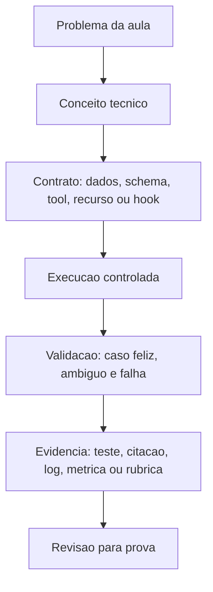
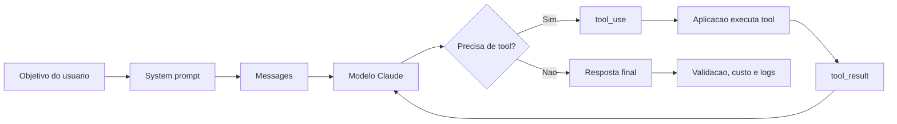
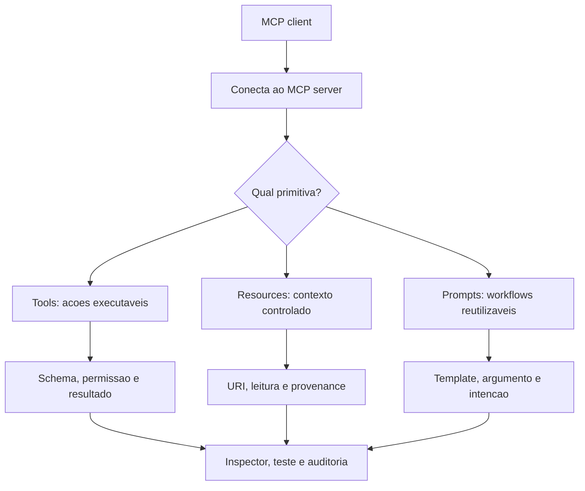
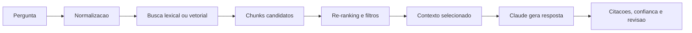
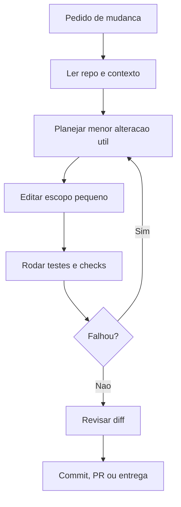

# 27 - Modelo De Aula Densa, Diagramas E Fontes

Esta pagina documenta o padrao de profundidade usado nas aulas navegaveis da
Academia. O objetivo e transformar cada topico em uma mini-aula completa:
conceito, arquitetura, fluxo, risco, validacao, fonte e treino deliberado.

## 1. Estrutura Que Toda Aula Deve Ter

Cada aula deve responder a sete perguntas:

1. Qual problema esta aula resolve?
2. Qual decisao arquitetural ela ensina?
3. Qual contrato tecnico precisa existir?
4. Qual fluxo operacional transforma conceito em execucao?
5. Quais falhas sao esperadas?
6. Como provar que a solucao funcionou?
7. Quais fontes oficiais, academicas ou profissionais sustentam o estudo?

## 2. Densidade Esperada Por Explicacao

A explicacao de uma aula nao deve ser so uma definicao. Ela deve ter:

- explicacao normal;
- explicacao tecnica;
- exemplo simplificado;
- passo a passo;
- aprofundamento especialista;
- fluxograma;
- grafico de foco;
- criterios de prova;
- bibliografia orientada;
- protocolo de treino.

O aluno precisa sair da aula sabendo explicar o conceito para uma pessoa comum,
defender uma decisao para um arquiteto, implementar um exemplo minimo e responder
uma questao scenario-based.

## 3. Fluxo Mental Para Claude API

Pontos de prova:

- system prompt define comportamento persistente;
- messages carregam contexto conversacional;
- tools devem ter schema claro;
- `tool_result` volta como evidencia;
- resposta final precisa ser validada quando alimenta outro sistema.

## 4. Fluxo Mental Para MCP

Pontos de prova:

- tool nao e resource;
- prompt template nao e autorizacao;
- MCP amplia capacidade, mas tambem amplia superficie de risco;
- inspector serve para validar contrato antes de integrar;
- menor privilegio e obrigatorio em acoes.

## 5. Fluxo Mental Para RAG

Pontos de prova:

- RAG nao e so jogar PDF no prompt;
- chunking ruim compromete recuperacao;
- embedding e BM25 resolvem problemas diferentes;
- citacao nao substitui validacao;
- documentos confidenciais exigem controle de acesso antes da recuperacao.

## 6. Fluxo Mental Para Claude Code

Pontos de prova:

- explorar antes de editar;
- nao sobrescrever mudancas alheias;
- hooks e commands padronizam seguranca;
- SDK permite compor agentes;
- MCP adiciona integracoes, mas deve respeitar permissoes.

## 7. Bibliografia Tecnica E Academica

### Agentic AI E Tool Use

- ReAct: <https://arxiv.org/abs/2210.03629>
- Claude tool use overview:
  <https://platform.claude.com/docs/en/agents-and-tools/tool-use/overview>
- How tool use works:
  <https://platform.claude.com/docs/en/agents-and-tools/tool-use/how-tool-use-works>
- Anthropic courses:
  <https://github.com/anthropics/courses>
- Claude cookbooks:
  <https://github.com/anthropics/claude-cookbooks>

### Prompt Engineering E Structured Output

- Prompt engineering overview:
  <https://platform.claude.com/docs/en/build-with-claude/prompt-engineering/overview>
- Prompting best practices:
  <https://platform.claude.com/docs/en/build-with-claude/prompt-engineering/claude-prompting-best-practices>
- Structured outputs:
  <https://platform.claude.com/docs/en/build-with-claude/structured-outputs>
- Prompt engineering tutorial:
  <https://github.com/anthropics/prompt-eng-interactive-tutorial>

### MCP

- MCP specification:
  <https://modelcontextprotocol.io/specification/2025-06-18>
- MCP tools:
  <https://modelcontextprotocol.io/specification/2025-06-18/server/tools>
- Microsoft MCP for Beginners:
  <https://github.com/microsoft/mcp-for-beginners/>
- Model Context Protocol resources:
  <https://github.com/cyanheads/model-context-protocol-resources>

### RAG E Busca

- Retrieval-Augmented Generation:
  <https://arxiv.org/abs/2005.11401>
- Claude search results:
  <https://platform.claude.com/docs/en/build-with-claude/search-results>
- Claude citations:
  <https://platform.claude.com/docs/en/build-with-claude/citations>
- Claude PDF support:
  <https://platform.claude.com/docs/en/build-with-claude/pdf-support>

### Claude Code

- Claude Code MCP:
  <https://code.claude.com/docs/en/mcp>
- Hooks reference:
  <https://code.claude.com/docs/en/hooks>
- Agent SDK overview:
  <https://code.claude.com/docs/en/agent-sdk/overview>
- Claude Code hooks mastery:
  <https://github.com/disler/claude-code-hooks-mastery>

### Seguranca, QA E Governanca

- NIST AI Risk Management Framework:
  <https://www.nist.gov/itl/ai-risk-management-framework>
- NIST AI 600-1 Generative AI Profile:
  <https://www.nist.gov/publications/artificial-intelligence-risk-management-framework-generative-artificial-intelligence>
- OWASP Top 10 for LLM Applications:
  <https://owasp.org/www-project-top-10-for-large-language-model-applications/>

## 8. Criterio De Pronto Para Uma Aula

Uma aula so esta suficientemente densa quando:

- tem explicacao tecnica que nao depende de assistir video;
- tem exemplo simplificado;
- tem fluxo visual;
- tem pelo menos uma fonte oficial ou academica;
- tem pelo menos um risco ou falha comum;
- tem um exercicio pratico;
- tem criterio de prova;
- deixa claro qual alternativa seria errada e por que.

