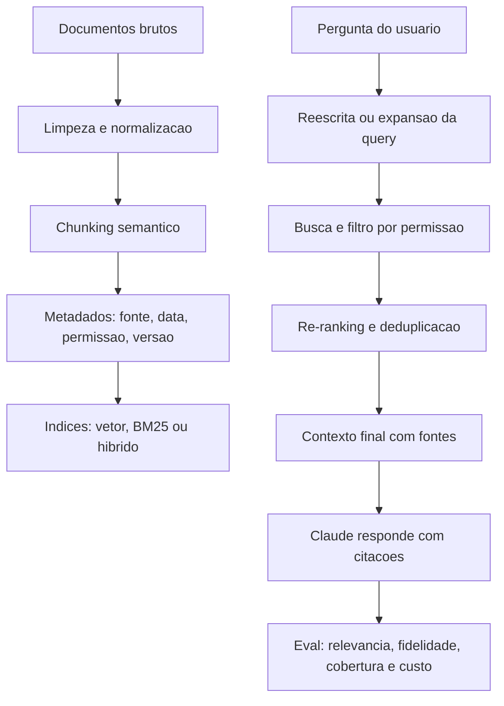
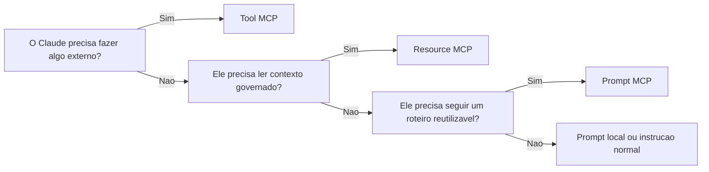
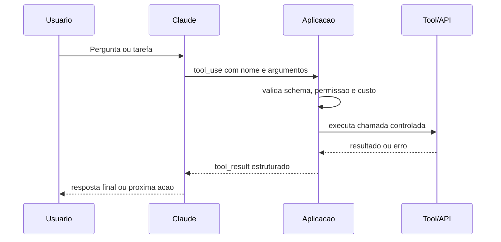
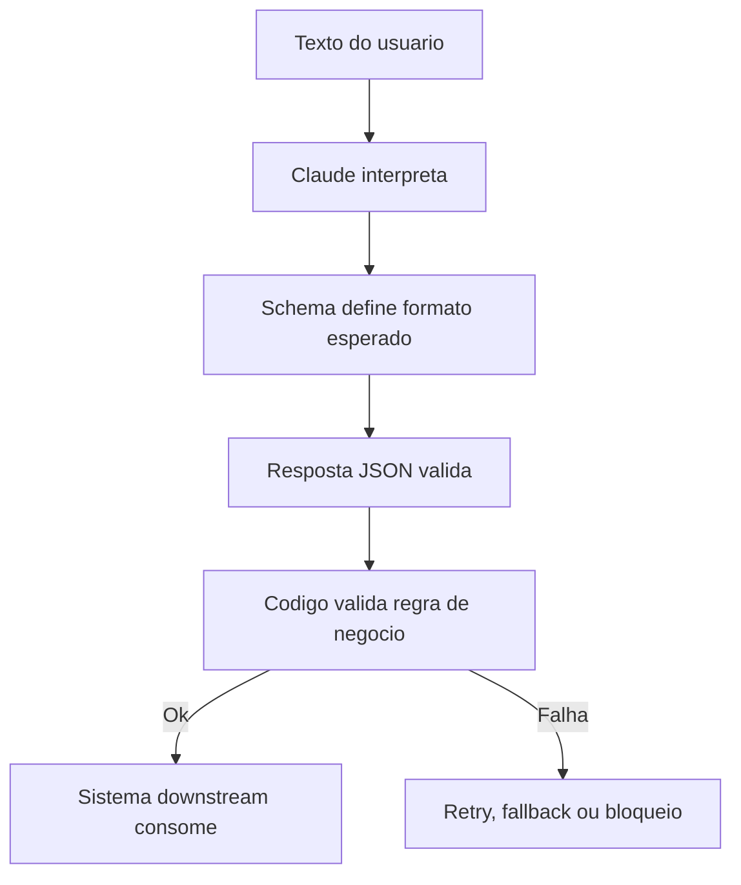
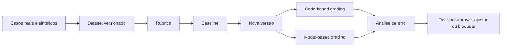
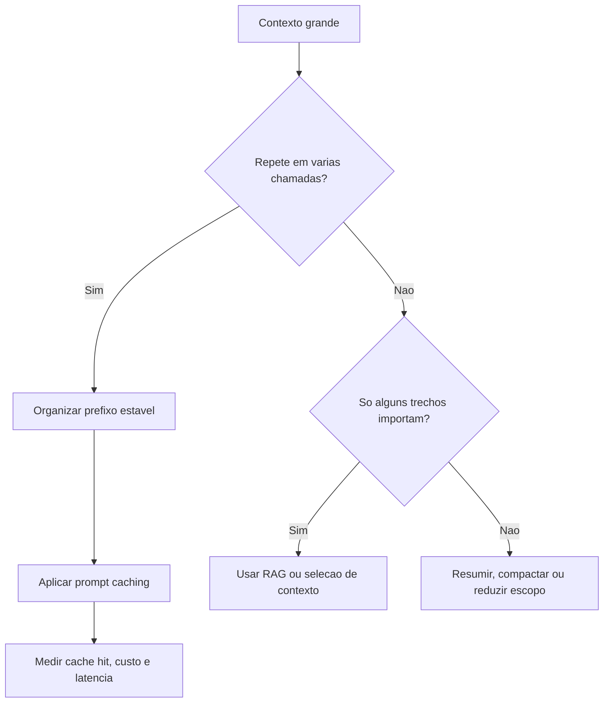
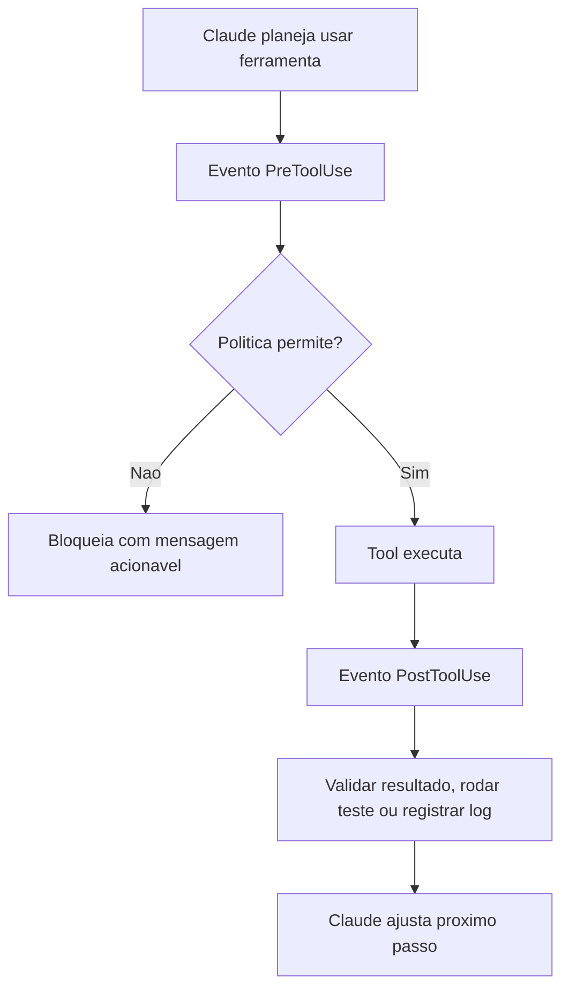
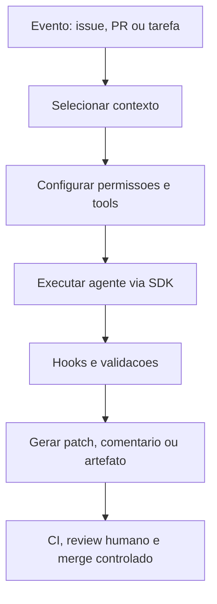

# Aulas Criticas Aprofundadas

Este documento aprofunda manualmente as aulas mais importantes para a certificacao:
RAG, MCP tools/resources/prompts, tool use, structured outputs, evals, prompt
caching, hooks e Claude Code SDK.

A ideia nao e substituir a academia navegavel, mas criar uma camada de estudo
mais densa. Cada secao deve responder quatro perguntas:

1. O que e o conceito, tecnicamente?
2. Como ele aparece em uma arquitetura real?
3. Como reconhecer a alternativa correta em prova?
4. Como praticar ate conseguir explicar sem decorar?

## 1. RAG e Agentic Search

### Conceito tecnico

Retrieval-Augmented Generation, ou RAG, combina duas capacidades: recuperacao
de informacao externa e geracao de resposta pelo modelo. O modelo nao recebe
todo o conhecimento do mundo no prompt. A aplicacao seleciona trechos
relevantes de uma base, monta um contexto controlado e pede ao Claude para
responder com base nesse contexto.

O ponto que mais cai em arquitetura e que RAG e pipeline, nao prompt. Um sistema
RAG minimamente serio tem ingestao, limpeza, chunking, metadados, indexacao,
busca, ranking, montagem de contexto, resposta, citacoes e avaliacao. Quando
uma questao de prova diz "a resposta precisa ser atualizada", "precisa citar a
fonte", "o conteudo muda com frequencia" ou "ha documentos internos", a solucao
provavelmente envolve RAG ou busca controlada.

O erro mais comum e achar que RAG reduz alucinacao automaticamente. Ele reduz
alucinacao quando recupera as evidencias corretas, filtra permissao, remove
ruido e obriga a resposta a respeitar os trechos recuperados. Se o sistema
recupera documentos errados, o modelo ainda pode responder bem escrito e errado.

### Fluxo de arquitetura

### Passo a passo de implementacao

1. Defina o corpus: quais documentos entram, quem pode ver, com qual
   periodicidade atualizam e qual fonte e considerada autoritativa.
2. Crie uma politica de limpeza: remova duplicatas, preserve titulos, tabelas,
   links, datas, secoes e identificadores.
3. Escolha chunking por estrutura, nao por numero fixo de caracteres. Politicas,
   contratos, codigo e FAQ pedem cortes diferentes.
4. Adicione metadados: `source_id`, `url`, `owner`, `created_at`, `updated_at`,
   `access_level`, `section`, `version`.
5. Crie busca hibrida quando houver termos tecnicos, siglas, codigos, nomes de
   API ou vocabulario que embeddings podem suavizar demais.
6. Filtre permissao antes de montar contexto. Nao recupere primeiro para filtrar
   depois se isso puder expor existencia de documento.
7. Monte o prompt com regra clara: responda apenas com base nas evidencias,
   cite fontes, diga quando nao houver suporte suficiente.
8. Avalie com perguntas que tenham documento correto, documento distrator e caso
   em que a resposta correta e "nao ha evidencia suficiente".

### Exemplo simplificado

Imagine que voce tem uma biblioteca com milhares de apostilas. RAG nao e pedir
para o aluno decorar tudo. E pedir para alguem buscar as paginas certas, separar
as paginas irrelevantes, mostrar de qual livro saiu cada trecho e entao escrever
a resposta usando somente aquilo.

Se a pagina escolhida esta errada, a resposta final tambem tende a ficar errada.
Por isso o trabalho principal nao e "fazer o modelo responder bonito"; e fazer a
busca encontrar a evidencia certa.

### Pegadinhas de prova

- "Colocar todos os documentos no prompt" nao escala e aumenta ruido.
- "Usar embeddings" nao substitui controle de permissao.
- "Citar fonte" nao prova fidelidade se a frase nao foi sustentada pela fonte.
- "Melhorar o prompt" nao corrige indice ruim.
- "RAG" nao e sempre melhor que structured output, tool use ou cache. Use RAG
  quando o problema e conhecimento externo recuperavel.

### Criterio de dominio

Voce domina RAG quando consegue desenhar o pipeline inteiro, explicar porque
chunking muda qualidade, escolher entre BM25, embeddings e hibrido, proteger
documentos por permissao, criar citacoes uteis e montar um eval que mede
recuperacao e fidelidade separadamente.

## 2. MCP Tools, Resources e Prompts

### Conceito tecnico

Model Context Protocol e um padrao de integracao entre clientes, servidores e
capacidades externas. Ele evita que cada ferramenta tenha uma integracao
isolada e cria uma forma comum de expor contexto e acoes para clientes
compatíveis com MCP.

As tres primitivas mais importantes sao:

- **Tools**: operacoes chamaveis, normalmente com parametros e resultado.
- **Resources**: dados ou contexto consultavel, como arquivos, schemas,
  configuracoes, documentos ou registros.
- **Prompts**: workflows ou templates reutilizaveis, parametrizados e
  distribuidos para o cliente.

A diferenca importa muito. Se voce transforma tudo em tool, o modelo passa a
pedir "acoes" ate para ler contexto. Se transforma tudo em prompt, perde
contrato de dados. Se transforma tudo em resource, nao executa operacoes. Boa
arquitetura escolhe a primitiva pelo tipo de responsabilidade.

### Fluxo de decisao

### Passo a passo de design

1. Escreva a necessidade em linguagem operacional: "consultar pedido",
   "ler politica", "gerar resumo tecnico", "abrir ticket".
2. Classifique como acao, contexto ou workflow.
3. Defina o contrato minimo. Para tool: nome, descricao, input schema,
   output esperado, erros. Para resource: URI, tipo, permissao, atualizacao.
   Para prompt: parametros, objetivo, formato e limites.
4. Reduza permissao. Um servidor MCP nao deve expor "tudo do computador" quando
   a aula so precisa ler uma pasta de estudo.
5. Teste no inspector. O inspector ajuda a verificar discovery, schema,
   resposta, erro e experiencia antes de conectar a um cliente real.
6. Registre observabilidade: chamada, parametros nao sensiveis, latencia, erro,
   versao do servidor e decisao de bloqueio.

### Exemplo simplificado

Pense em MCP como uma sala de estudos organizada. As tools sao coisas que fazem
algo, como "buscar video" ou "calcular custo". Os resources sao materiais que
podem ser lidos, como apostilas e tabelas. Os prompts sao roteiros prontos,
como "me sabatine sobre RAG".

O aluno nao precisa carregar a escola inteira na mochila. Ele precisa acessar a
coisa certa na hora certa.

### Riscos tecnicos

- Tool poisoning: uma tool com nome ou descricao enganosa induz uso errado.
- Resource injection: um documento recuperado tenta virar instrucao do sistema.
- Permissao ampla: servidor acessa mais arquivos, contas ou APIs do que precisa.
- Schema fraco: parametros ambiguos geram chamadas erradas.
- Falta de inspector: erros aparecem apenas quando o usuario ja esta usando.

### Criterio de dominio

Voce domina MCP quando consegue explicar a separacao cliente-servidor, escolher
entre tool/resource/prompt, escrever um schema restrito, testar no inspector e
desenhar controles de permissao e logs sem vazar informacao sensivel.

## 3. Tool Use com Claude

### Conceito tecnico

Tool use e o mecanismo pelo qual Claude solicita que a aplicacao execute uma
funcao externa. O modelo nao deveria chamar banco, API ou sistema operacional
diretamente. Ele emite uma solicitacao de tool com argumentos. A aplicacao
valida, executa fora do modelo, devolve `tool_result`, e o Claude continua a
partir da observacao.

Esse ciclo separa raciocinio e execucao. O modelo decide que precisa consultar
um pedido; o codigo decide se pode consultar, com quais parametros, em qual
servico, com timeout e logs. Essa separacao e um dos principios centrais de
arquitetura agentic segura.

### Fluxo operacional

### Como desenhar uma boa tool

Uma boa tool tem nome especifico, descricao que orienta decisao, schema de
entrada restrito, resultado pequeno e erros previsiveis. Uma tool chamada
`do_anything` e ruim porque obriga o modelo a decidir detalhes que deveriam ser
contrato de sistema. Uma tool chamada `consultar_status_pedido` com
`order_id`, `customer_id` e erro `permission_denied` e muito mais testavel.

### Exemplo simplificado

Uma tool e um formulario que o Claude preenche para pedir uma acao. Se o
formulario pergunta exatamente o que precisa, o sistema consegue executar. Se o
formulario e uma folha em branco, alguem precisa adivinhar. Em software,
adivinhacao vira erro.

### Pegadinhas de prova

- Tool use nao remove necessidade de validacao no codigo.
- Tool_result nao e instrucao de sistema; e dado observado.
- Tool ampla demais aumenta risco de agencia excessiva.
- Erro estruturado e melhor que resposta textual confusa.
- Multi-turn com varias tools exige limite de passos, custo e criterio de
  parada.

### Criterio de dominio

Voce domina tool use quando sabe desenhar tool estreita, validar argumentos,
devolver erro recuperavel, controlar loops multi-turn e explicar por que a
aplicacao, nao o modelo, deve executar a acao real.

## 4. Structured Outputs e JSON Schema

### Conceito tecnico

Structured output e contrato de formato. Quando a resposta vai ser lida por uma
pessoa, texto livre pode ser suficiente. Quando a resposta vai ser lida por uma
maquina, texto livre vira risco. Campos podem sumir, tipos podem mudar e
explicacoes podem aparecer misturadas ao dado.

JSON Schema e strict tool use reduzem essa variabilidade. JSON outputs ajudam a
controlar a resposta final. Strict tool use ajuda a garantir parametros validos
quando Claude chama tools. As duas coisas podem ser combinadas em workflows
agentic.

### Diagrama de responsabilidade

### O que structured output resolve

- JSON malformado.
- Campo obrigatorio ausente.
- Tipo inconsistente.
- Formato imprevisivel.
- Dificuldade de integrar com API ou banco.

### O que structured output nao resolve sozinho

- Verdade factual.
- Fonte correta.
- Permissao.
- Regra de negocio.
- Decisao etica ou legal.
- Risco de prompt injection em dados de entrada.

### Exemplo simplificado

Pedir "responda em JSON" e como pedir para alguem fazer uma tabela de cabeca.
Structured output e entregar o modelo da tabela com colunas obrigatorias e tipo
de cada coluna. Ainda e preciso conferir se o conteudo esta certo, mas o formato
fica previsivel.

### Criterio de dominio

Voce domina structured output quando distingue formato de verdade, escolhe entre
JSON outputs e strict tool use, escreve schemas pequenos, valida regras no
codigo e entende impacto de versao de schema em consumidores downstream.

## 5. Evals, Datasets e Rubricas

### Conceito tecnico

Evals sao testes de qualidade para sistemas de IA. Eles respondem: "essa versao
esta melhor que a anterior?", "o prompt novo quebrou algo?", "o RAG recupera as
fontes certas?", "o structured output respeita o schema?", "a tool escolhida e
a correta?".

Sem eval, melhoria e opiniao. Com eval, melhoria vira evidencia. O ciclo ideal
tem dataset, rubrica, baseline, execucao, analise de erro e regressao.

### Fluxo de avaliacao

### Tipos de avaliacao

**Code-based grading** e melhor quando a resposta tem criterio objetivo:
schema valido, campo obrigatorio, citacao presente, tool escolhida, erro
esperado, numero dentro de faixa.

**Model-based grading** e melhor quando a resposta exige julgamento semantico:
clareza, completude, aderencia a tom, qualidade de resumo, utilidade e
fidelidade textual. Ele precisa de rubrica clara e auditoria humana.

**Human review** continua importante para calibrar rubrica, revisar riscos e
avaliar casos de alto impacto.

### Exemplo simplificado

Eval e gabarito de prova. Sem gabarito, cada pessoa corrige de um jeito. Com
gabarito e rubrica, fica claro o que vale ponto, o que e erro pequeno e o que e
erro fatal.

### Criterio de dominio

Voce domina evals quando consegue criar dataset com casos normais, borda e
ataques, escrever rubrica, separar avaliacao por codigo e por modelo, medir
baseline e transformar erro em melhoria de arquitetura.

## 6. Prompt Caching, Contexto e Custo

### Conceito tecnico

Prompt caching reduz custo e latencia quando uma parte grande do prompt se
repete entre chamadas. Ele e especialmente relevante para documentos longos,
schemas, regras de sistema, tools e material de referencia que permanecem
estaveis.

O ponto de arquitetura e organizar o contexto em camadas. Prefixo estavel vem
antes; tarefa especifica e historico dinamico ficam depois. Se voce muda o
inicio do prompt a cada chamada, o cache tende a perder valor.

### Fluxo de decisao

### Boas praticas

- Coloque regras estaveis antes de dados dinamicos.
- Nao insira timestamps, usuario ou pergunta antes do bloco cacheavel.
- Meca tokens antes de otimizar.
- Use diagnostics para entender hit/miss.
- Compare cache com RAG: cache e bom para repeticao; RAG e bom para selecao.

### Exemplo simplificado

Cache e deixar uma apostila grande aberta na mesa. Se voce consulta a mesma
apostila varias vezes, economiza tempo. Se voce troca a apostila inteira a cada
pergunta, nao ha economia.

### Criterio de dominio

Voce domina prompt caching quando sabe separar prefixo estavel, medir tokens,
diagnosticar cache miss, estimar custo e decidir entre cache, RAG, resumo,
compactacao ou modelo menor.

## 7. Claude Code Hooks

### Conceito tecnico

Hooks sao controles deterministas no ciclo do Claude Code. Eles podem bloquear,
validar, auditar ou acionar tarefas em pontos especificos. A grande diferenca
entre hook e prompt e que o prompt orienta comportamento, enquanto o hook pode
executar uma regra objetiva.

Quando uma regra e critica, como impedir delete fora do workspace, validar
segredo, rodar teste depois de edicao ou bloquear arquivo sensivel, hook e mais
forte que uma instrucao "por favor, nao faca".

### Fluxo de controle

### Gotchas importantes

- Regex simples pode bloquear comando legitimo ou deixar passar comando perigoso.
- Hook lento quebra experiencia.
- Log sem filtro pode vazar token ou dado interno.
- Blacklist e fraca para operacoes sensiveis; allowlist costuma ser melhor.
- Hook que altera arquivo automaticamente pode gerar diff dificil de revisar.
- Validacao depois da execucao pode ser tarde demais para operacao destrutiva.

### Exemplo simplificado

Hook e catraca. Uma placa dizendo "nao entre" ajuda, mas nao impede. A catraca
impede quando a regra e critica. Mas se a catraca bloquear todo mundo, o fluxo
para. Por isso hook precisa ser preciso.

### Criterio de dominio

Voce domina hooks quando sabe escolher o evento certo, criar politica objetiva,
testar falso positivo, sanitizar logs, escrever mensagem de bloqueio acionavel e
explicar quando usar hook, command, Skill, CI ou prompt.

## 8. Claude Code SDK, GitHub e CI

### Conceito tecnico

O SDK permite transformar o uso de Claude Code em workflows programaticos. Em
vez de depender de uma sessao manual, um time pode criar automacoes para revisar
PR, gerar testes, triagear issues, atualizar documentacao, executar migracoes
assistidas e integrar agentes com ferramentas e MCP.

O risco e automatizar sem processo. SDK bom preserva engenharia: escopo pequeno,
contexto selecionado, permissoes minimas, hooks, testes, logs, PR revisavel,
branch protection e rollback.

### Fluxo de workflow programatico

### Exemplo simplificado

Usar SDK e colocar o assistente dentro do processo da empresa. Ele pode preparar
um PR, escrever resumo e rodar testes, mas nao deve ganhar acesso irrestrito a
contas, segredos ou deploy. O processo continua mandando.

### Criterio de dominio

Voce domina SDK quando consegue desenhar um workflow completo com entrada,
contexto, permissoes, tools, hooks, validacao, saida, logs, CI e aprovacao
humana quando houver risco.

## Matriz De Decisao Para Prova

| Sinal no enunciado | Resposta mais provavel |
|---|---|
| Documento atualizado, fonte, conhecimento externo | RAG ou busca com citacoes |
| Acao externa parametrizada | Tool use |
| Integracao padronizada com cliente-servidor | MCP |
| Contexto governado consultavel | MCP resource |
| Workflow reutilizavel parametrizado | MCP prompt |
| Saida consumida por sistema | Structured output |
| Saber se melhorou | Eval com baseline |
| Custo alto por contexto repetido | Prompt caching |
| Bloquear antes de executar | Hook |
| Automatizar fluxo de desenvolvimento | Claude Code SDK + CI |

## Critica Das Escolhas Deste Material

Esta expansao aprofunda os pontos mais cobraveis, mas ainda tem limites. Primeiro,
ela cria uma camada conceitual forte, nao uma implementacao executavel completa
para cada caso. O proximo nivel seria transformar cada topico em laboratorio com
codigo real, entradas, saidas esperadas e testes automatizados.

Segundo, o material privilegia seguranca e arquitetura. Isso e correto para uma
certificacao de arquiteto, mas pode parecer mais lento para quem quer apenas
"fazer funcionar". A decisao e intencional: em producao, fazer funcionar sem
permissao, eval, schema ou logs costuma virar risco.

Terceiro, os fluxos simplificam nuances de provedores, modelos e SDKs que mudam
com o tempo. Por isso cada secao aponta fontes oficiais e deve ser revisada
periodicamente.

## Fontes Principais

- Anthropic Claude structured outputs:
  <https://platform.claude.com/docs/en/build-with-claude/structured-outputs>
- Anthropic Claude tool use:
  <https://platform.claude.com/docs/en/agents-and-tools/tool-use/overview>
- Anthropic Claude prompt caching:
  <https://platform.claude.com/docs/en/build-with-claude/prompt-caching>
- Claude Code hooks:
  <https://code.claude.com/docs/en/hooks>
- Claude Agent SDK:
  <https://code.claude.com/docs/en/agent-sdk/overview>
- Model Context Protocol:
  <https://modelcontextprotocol.io/docs/getting-started/intro>
- MCP specification:
  <https://modelcontextprotocol.io/specification/2025-06-18>
- Retrieval-Augmented Generation for Knowledge-Intensive NLP Tasks:
  <https://arxiv.org/abs/2005.11401>
- ReAct: Synergizing Reasoning and Acting in Language Models:
  <https://arxiv.org/abs/2210.03629>
- OWASP Top 10 for LLM Applications:
  <https://owasp.org/www-project-top-10-for-large-language-model-applications/>
- NIST AI Risk Management Framework:
  <https://www.nist.gov/itl/ai-risk-management-framework>
